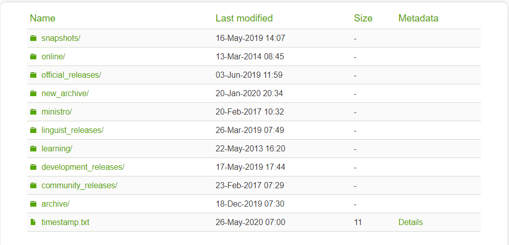
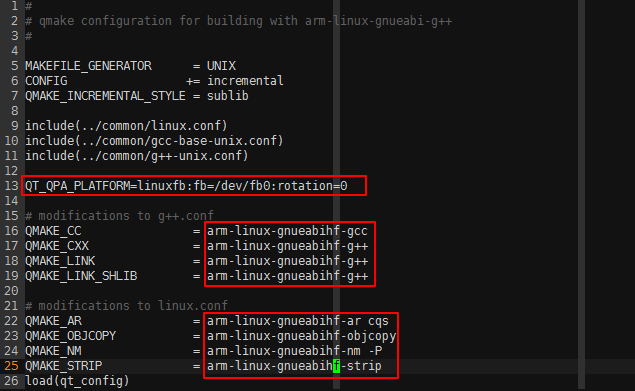
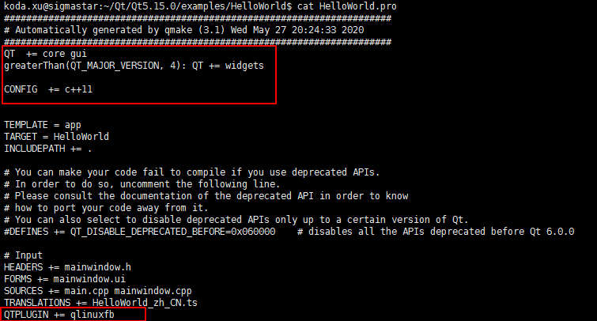

# Qt5.15_example
Qt5.15 examples for testing.

## 本环境基于Qt5.15.0构建，分为以下部分。
qt5.15_lib.tar.gz - Qt5.15.0交叉编译生成库  
examples.tar.gz   - Qt样例程序  
dispInit.tar.gz	  - 初始化disp和panel样例程序  
qt_test.tar.gz	  - Qt样例程序运行环境  

## 构建过程  
### 环境准备
Qt5下载地址：<http://download.qt.io/>  


### 目录结构说明
| 目录 | 说明 |  
| :---- | :---- |  
| archive | 各种Qt开发工具安装包，包含新旧版本，可以下载开发工具和源码 |  
| community_releases | 社区定制的Qt库，Tizen版Qt以及Qt附加源码包 |
| development_releases | 开发版，包含新的和旧的不稳定版本，在Qt开发过程中的非正式版本 |
| learning | 有学习Qt的文档教程和示范视频 |
| ministro | Mini版本，目前是针对Android的版本 |
| official_releases | 正式发布版，是与开发板相对的稳定版Qt开发库和开发开发工具，可以下载开发工具和源码 |
| online | Qt在线安装源 |
| snapshots | 预览版，最新的开发测试中的Qt库和开发工具 |

当前环境使用archive Qt5.15.0版本。
<http://download.qt.io/archive/qt/5.15/5.15.0/single/qt-everywhere-src-5.15.0.tar.xz.mirrorlist>

## Qt5交叉编译
本例使用toolchain: gcc-arm-8.2-2018.08-x86_64-arm-linux-gnueabihf编译qt5。编译依赖perl5.8或以上版本，python2.7或以上版本。要支持使用触摸还需要链接tslib库。  
### 下载toolchain gcc-arm-8.2-2018.08-x86_64-arm-linux-gnueabihf.tar.xz：  
<https://developer.arm.com/tools-and-software/open-source-software/developer-tools/gnu-toolchain/gnu-a/downloads>  

### 设置环境变量：  
vim /etc/profile 添加toolchain路径：  
**export PATH=/opt/toolchain/gcc-arm-8.2-2018.08-x86_64-arm-linux-gnueabihf/bin:$PATH**

### 安装perl，python：
**sudo apt-get install perl Python2.7**

### 安装git工具：
**sudo apt-get install git**

### 下载tslib：
**git clone https://github.com/libts/tslib.git**

### 编译tslib：
**sudo apt-get install automake**    
**sudo apt-get install autogen**  
**sudo apt-get install libtool**  
**./autogen.sh**  
**./configure --prefix=/home/koda.xu/workspace/tslib_1.21/arm_tslib --host=arm-linux ac_cv_func_malloc_0_nonnull=yes CC=arm-linux-gnueabihf-gcc**  
**make –j4**  
**make install**  

--prefix为tslib导出的头文件和lib存放路径。

### 编译Qt5：
下载Qt5.15.0 opensource code包 qt-everywhere-src-5.15.0.tar.xz
**xz –d qt-everywhere-src-5.15.0.tar.xz**  
**tar xf qt-everywhere-src-5.15.0.tar**  
**cd qt-everywhere-src-5.15.0**  
**vi qtbase/mkspecs/linux-arm-gnueabi-g++/qmake.conf**  
修改如下：  
  

### 设置configure
```
./configure \
  -prefix /home/koda.xu/Qt/Qt5.15.0/qt5.15_lib \
  -static \
  -release \
  -opensource \
  -make libs \
  -xplatform linux-arm-gnueabi-g++ \
  -optimized-qmake -pch \
  -qt-libjpeg \
  -qt-libpng \
  -qt-zlib \
  -no-opengl \
  -skip qt3d \
  -skip qtcanvas3d \
  -skip qtpurchasing \
  -skip qtlocation \
  -skip qttools \
  -no-sse2 \
  -no-openssl \
  -no-cups \
  -no-glib \
  -no-iconv \
  -nomake examples \
  -tslib \
  -linuxfb \
  -I /home/koda.xu/Qt/tslib_1.21/arm_tslib/include \
  -L /home/koda.xu/Qt/tslib_1.21/arm_tslib/lib
```

-prefix 设置部署路径
-I XXX  设置引用头文件路径
-I XXX	设置链接库路径

### 编译
**make –j4**  
**make install**  

### 导出环境变量
**vim ~/.bashrc** 
**export PATH=/home/koda.xu/workspace/Qt5.15.0/qt5.15.0_lib/bin:$PATH**

## Qt example
ftp /SSD20X/Demo_Release/UI_DEMO/Qt5.15.0 目录下有qt example，以HelloWorld为例，编译Qt app方法如下：  
进入HelloWorld目录，执行qmake -project，生成.pro文件。  
**1. 编辑.pro文件**    
  

**2. qmake**     

**3. make**  
在HelloWorld目录生成HelloWorld bin档   

**4. 初始化disp&panel**   
运行demo前需要先初始化disp和panel，见dispInit，在该目录执行make生成档。   

**5. 运行qt app**   
先运行dispInit初始化disp和panel，可参考dispInit/run.sh；  
运行qt app，可参考HelloWorld/run.sh  
